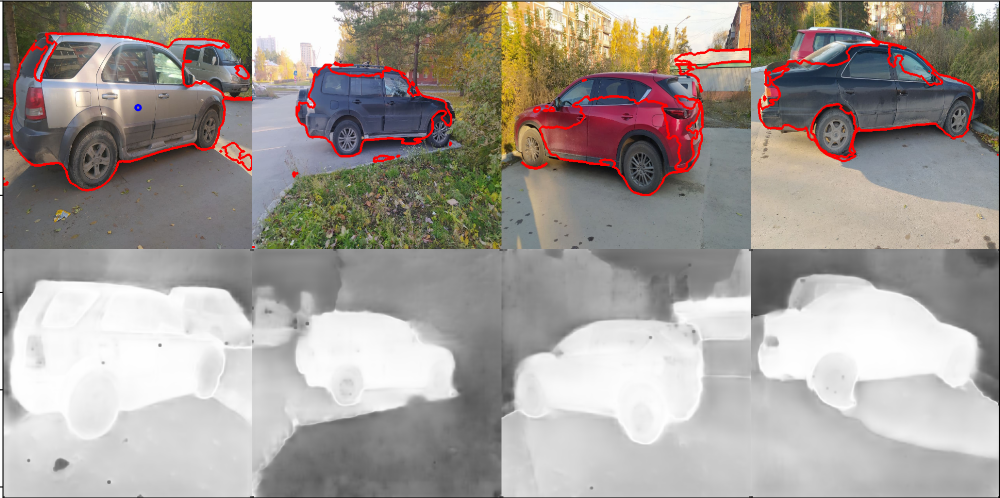
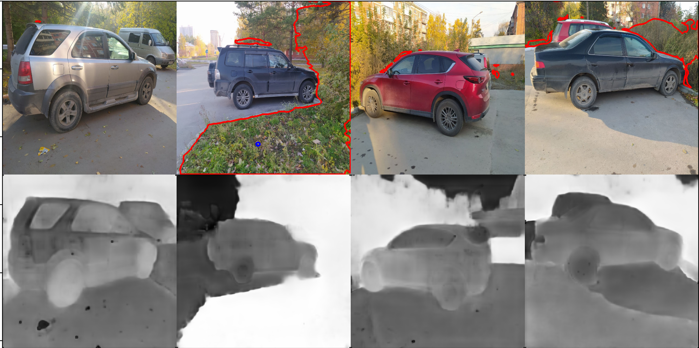

# pixel-wise-embedding

Train embedding vectors for each pixel of image.

# Results

# Datasets

[ADE20K](https://groups.csail.mit.edu/vision/datasets/ADE20K/)

[COCOStaff](https://github.com/nightrome/cocostuff?ysclid=l5jxcaiems54765639)

# Models

Use [smp](https://github.com/qubvel/segmentation_models.pytorch?ysclid=l5jxdpw5gm170547452) models for generating features for each pixels.
Best architecture - FPN.

# Weights

FPN (256 features) - [download_model](https://drive.google.com/file/d/1VcmNGuhh5QbiJXITxnd299c1WUv2oMQ9/view?usp=sharing)

# Colab

[Colab](https://colab.research.google.com/drive/1YCwRxmGxig1zsxrWkRtz3NR1JDxbVu3q?usp=sharing)